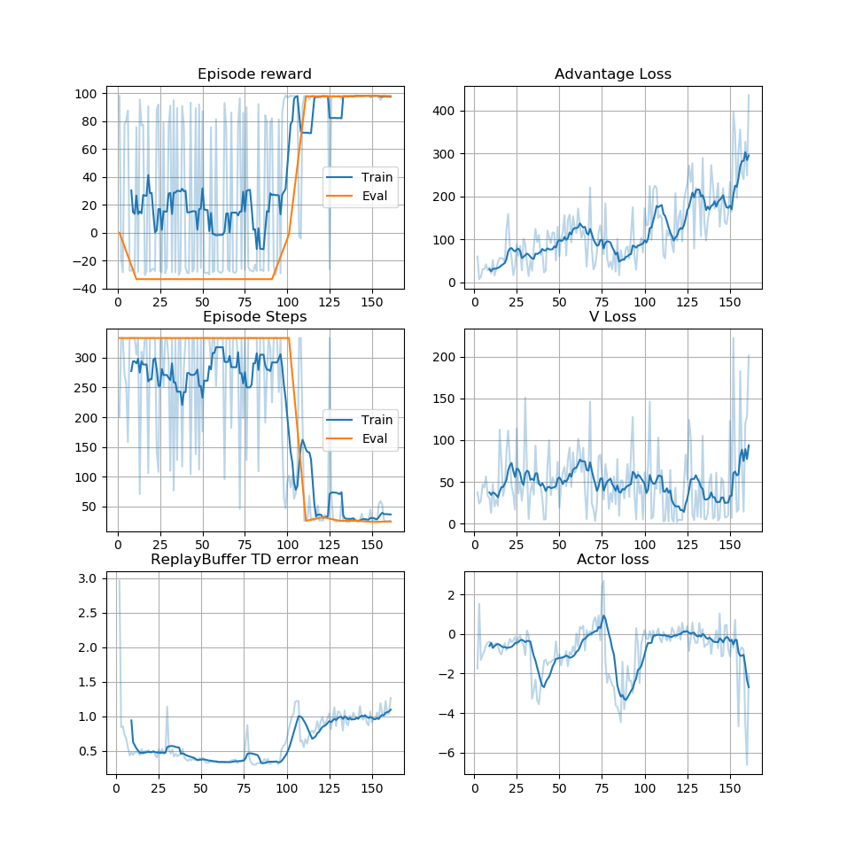

# Deep RL Quadcopter Controller

In this project, I'm trying to design an agent to fly a quadcopter, and then train it using a reinforcement learning algorithm.
Current version has simplified task - learn `MountainCarContinuous-v0` task from ai-gym.

## Features

* Simple Q-Network as an Agent Critic;
* Simple Policy;
* Replay Buffer with priority replay. When sampling from it, Q-Network doesn't take into account that some samples are fetched more often;
* Statistics visualization;
* Tensorflow implementation.

## Metrics



## Project Instructions

```
python test.py
```
